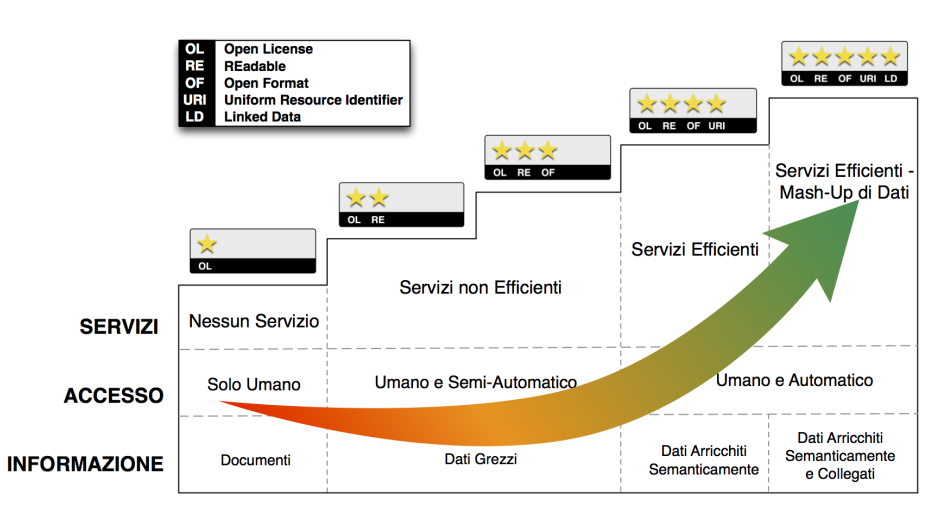
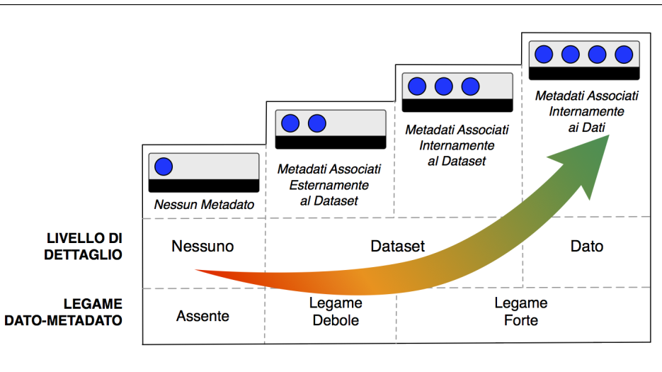
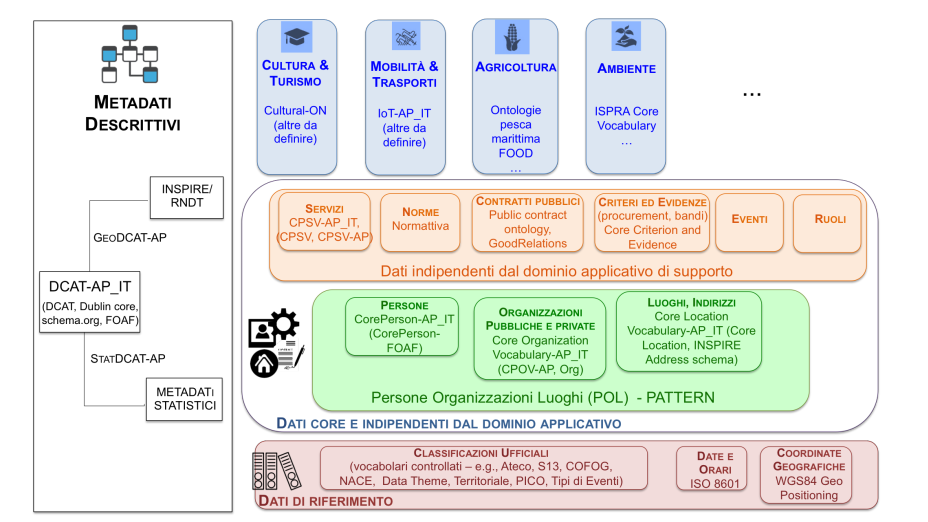
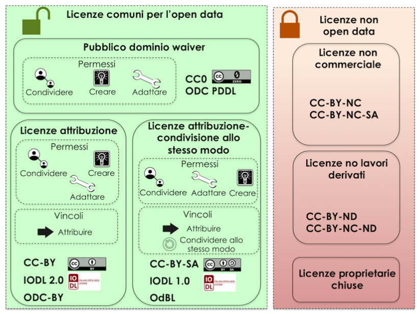

# Open Data

Il presente elaborato si basa su:
* Linee guida nazionali per la valorizzazione del patrimonio informativo pubblico (13/02/2020)
* Interoperabilità .........

Gli Open Data sono dati gestiti dalla PA **conoscibili da chiunque** quindi non riguardano dati che le PA elaborano per fini istituzionali o comunque dati personali e quelli a conoscibilità limitata (es.coperti da segreto di stato, diritto d'autore).

Pertanto dovranno essere:
* Disponibili -> accessibli on-line e facilmente trovabili
* Riutilizzabili e ridistribuibili
* Partecipazione universale

---

## Acronimi

Acronimo | Significato
-------- | -----------
ANNCSU | **A**nagrafe **N**azionale dei **N**umeri **C**ivici e delle **S**trade **U**rbane
ANPR | **A**nagrafe **N**azionale della **P**opolazione **R**esidente
API | **A**pplication **P**rogramming **I**nterface
CAD | **C**odice dell'**A**mministrazione **Di**gitale
CC | **C**reative **C**ommons
CMS | **C**ontent **M**anagement **S**ystem
CPSV | **C**ore **P**ublic **S**ervice **V**ocabulary
CSV | **C**omma **S**eparated **V**alue
DAF | **D**ata & **A**nalytcs **F**ramework
DCAT | **D**ata **C**atalog **V**ocabulary
DCAT-AP | **D**ata **C**atalog **V**ocabulary - **A**pplication **P**rofile
DCAT-AP_IT | **D**ata **C**atalog **V**ocabulary - **A**pplication **P**rofile **IT**aliano
D.Lgs | **D**ecreto **L**egislativo
GPS | **G**lobal **P**osition **S**ystem
HTTP | **H**yper**T**ext **T**ransfer **P**rotocol
INSPIRE | **IN**frastructure for **SP**atial **I**nfo**R**mation in **E**urope
ICT | **I**nformation and **C**ommunicatin **T**echnology
IoT | **I**nternet of **T**hings
IPA | **I**ndice della **P**ubblica **A**mministrazione
ISA | **I**nteroperability **S**olutions for public **A**dministration
LD | **L**inked **D**ata
LOD | **L**inked **O**pen **D**ata
JSON | **J**ava**S**cript **O**bject **N**otation
OD | **O**pen **D**ata
ODI | **O**pen **D**ata **I**nstitute
OF | **O**pen **F**ormat
OL | **O**pen **L**icense
OSM | **O**pen **S**treet **M**ap
OWL | **O**ntology **W**eb **L**anguage
OKFN | **O**pen **K**nowledge **F**ou**n**dation
PA | **P**ubblica **A**mministrazione
PSI | **P**ublic **S**ector **I**nformation
RDF | **R**esource **D**escription **F**ramework
RDFS | **R**esource **D**escription **F**ramework **S**chema
RE | **RE**adable
RNDT | **R**epertorio **N**azionale **D**ati **T**erritoriali
SDMX | **S**tatistical **D**ata and **M**etadata e**X**change
SPARQL | **S**parql **P**rotocol **A**nd **R**df **Q**uery **L**anguage
URI | **U**niform **R**esource **I**dentifier
XML | e**X**tensible **M**arkup **L**anguage
WGS | **W**orld **G**eodatic **S**ystem

---

## Scopo e destinatari

---

## Dati della Pubblica Amministrazione

Si intende per **Dato pubblico** quello conoscibile da chiunque (N.B.: il CAD non contiene più la definizione di dato pubblico).
Mentre si intende per **Formato dei dati di tipo aperto** un formato:
* reso pubblico;
* documentato esaustivamente;
* neutro rispetto alla tecnologia necessaria per la fruizione dello stesso;

Requisiti base di un **dato aperto** (Open Data):
1. **DISPONIBILE** *(REQUISITO GIURIDICO)* anche per finalità commerciali, in formato disaggregato;
2. **ACCESSIBILE** *(REQUISITO TECNOLOGICO)* ovvero in formato aperto e con i relativi metadati;
3. **GRATUITO** *(REQUISITO ECONOMICO)* ovvero disponibile a costi marginali sostenuti per la loro produzione (aspetto che verrà approfondito nella sezione - As.petti legali e di costo)

*Si ricorda che sono esclusi i dati personali e quelli a conosciblità limitata.*

---

## Normativa di riferimento

---

## Modello per i dati aperti

Il modello qualitativo adottato (ved.figura) è noto anche come **Modello a 5 stelle** il cui livello minimo di partenza è il livello 3.

Ogni livello deve essere valutato secondo 3 parametri:
* **_Servizi_**
* **_Accesso_**
* **_Informazione_**

### 1) Livello 1

Anche se i dati sono disponibili con licenza aperta, i documenti sono leggibili, interpretabili, elaborabili solo attraverso un significativo intervento umano (es. PDF).

### 2) Livello 2

* **_Informazione_**: dati in forma strutturata e con licenza aperta, mentre i formati restano proprietari (ex. Excel). Inoltre l'intervento umano è fortemente necessario per la loro interpretazione.

* **_Accesso_**: i programmi riescono ad elaborare i dati, ma non riescono ad interpretarli

* **_Servizi_**: i dati necesitano di servizi ad-hoc per consentirne l'accesso diretto via Web

### 3) Livello 3

* **_Informazione_**: dati in formato aperto e leggibili dai programmi, ma necessitano di intervento umano per l'elaborazione
* **_Accesso_**:_idem come sopra_
* **_Servizi_**:_idem come sopra_

### 4) Livello 4

* **_Informazione_**: dati esposti tramite standard come RDF e SPARQL, sono inoltre descritti semanticamente tramite metadati ed ongologie
* **_Accesso_**: siccome i programmi riconoscono l'ontologia possono elaborare i dati quasi senza ulteriore intervento umano
* **_Servizi_**: sfruttano accessi diretti a Web per reperire i dati

### 5) Livello 5

* **_Informazione_**: dati linked (Linked Open Data) ovvero in grado di referenziarsi e collegarsi tra loro. Sono descritti semanticamente tramite metadati ed ontologie, ad essi è assgnato un URI univoca sul Web. Per essere considerati Linked Data gli URI delle triple RDF devono essere utilizzabili da un agente Web per poter recuperare le info ad essi associati, diversamente non possono essere considerati LD.
* **_Accesso_**: _idem come sopra_
* **_Servizi_**: i link dei dati di interesse facilitano il mashup dei dati

---

## Modello per i metadati

I metadati sono info cruciali per il riuso dei dati. 

La loro classificazione qualitativa si fonda su 2 fattori:
* **legame tra dato-metadato**
* **livello di dettaglio**

### 1) Livello 1

Metadati non presenti, quindi nessun legame-

### 2) Livello 2

* **_legame tra dato-metadato_**: metadati esterni (es. in file separato) - legame debole
* **_livello di dettaglio_**: info relative a un dataset

### 3) Livello 3

* **_legame tra dato-metadato_**: i dati incorporano i metadati che li descrivono - legame forte
* **_livello di dettaglio_** _idem come sopra_

### 4) Livello 4

* **_legame tra dato-metadato_**: _idem come sopra_
* **_livello di dettaglio_**: i metadati forniscono info relative al singolo dato (max grado di dettaglio possibile)

---

## Aspetti organizzativi e qualità dei dati
### **Aspetti organizzativi**
#### I processi del modello operativo
 
1. **Dati NATIVI**: sono dati prodotti principalmente dagli uffici durante le funzioni amministrative. Necessario opportuno **Censimento** per individuare le _basi di dati primarie_ e comprendere le caratteristiche descrittive del dato, i tracciati record, il tasso temporale di aggiornamento, ... .
Inoltre è possibile arricchire i dati attraverso informazioni non rigorosamente connesse alle funzioni amministrative ma utili al riutilizzo dell'informazione magari perchè suggerito dall'esterno (approccio "demand-driven") in quanto è stato riscontrato un positivo impatto economico-sociale.
Seque poi un'**Analisi giuridica delle fonti** per la sostenibilità del tempo del processo di produzione e la pubblicazione dei dati (es. privacy).
Addirittura nella check-list suggerita dalle _Linee guida_ bisogna considerare la possibilità di de-anonimizzazione del dataset prima di pubblicarlo.
Successivamente bisogna effettuare un'**Analisi della qualità dei dati** (meglio descritta in seguito) e l'eventuale loro **Bonifica**: 
    * _sui dati_, attraverso confronto con il mondo reale o il matching con altri dataset. ;
    * oppure _sui processi_ per rimuovere a monte eventuali problemi.

    **Politiche di accesso e licenza** saranno approfondite meglio in seguito.

    Individuando gli attori che operano per la produzione dei dati è possibile anche **analizzare il processo di produzione** e **re-ingegnerizzarlo** per una produzione più efficiente.

    Con la **Metadatazione** si certificano le caratteristiche del dato, per tale operazione si rimanda al _modello per i metadati_ (ved.sopra) raccomandando di usare il profilo DCAT-AP_IT.

    Attraverso un **Data Hub interno**, verso il quale far confluire i dati prodotti (minimo liv.3) dai diversi dipartimenti, si procede alla loro **pubblicazione**.
Il _Data Hub_ è un'infrastruttura che permette un accesso tramite tag o query, è un nodo che può andare oltre la pubblicazione di dati di livello 3.

    Infine si procede con la **Conservazione e storicizzazione** al fine di mantenere le diverse versioni dei dati accessibili attraverso un URL stabile e documentato.

2. **Dati MASHUP**: qui si pone in risalto la sensibilità della PA agli stimoli esterni provenienti dalla società civile. In questa linea i dati sono frutto di uno specifico _concept_ opportunamente studiato con l'intervento di più fonti che collaborano per l'integrazione dei loro dati attraverso opportuni algoritmi. Cruciale in questa linea sono la definizione delle modalità di accesso ai dati e quelle del loro rilascio ed aggiornamento. Solitamente l'obiettivo è l'ottenimento di API e/o la pubblicazione di altri dataset.

3. **LINKED OPEN DATA**: si rimanda alle [linee guida della Commissione di Coordinamento SPC1 sull'interoperabilità semantinca attraverso i Linked Open Data](https://) (2012) che propongono una metodologia ancora valida e solida per la realizzazione dei LOD alla data di realizzazione di questo elaborato (2021).

4. **COINVOLGIMENTO (Engagement)**: degli stakeholder sia interni che esteni l'amministrazione, individuando in primis i soggetti da coinvolgere e successivamente le modalità di coinvolgimento, ad esempio: comunicazione interattiva, presentazione di scenari d'suo, app e hackaton.

    In particolare si tenga presente il _modello internazionale a 5 (__*****__) stelle dell'engagement_ di Tim Davies che si compone dei seguenti livelli:

    __(*)__ essere guidati dalla domanda;

    __(**)__ accompagnare i dati con una ricca documentazione;

    __(***)__ supportare conversazioni intorno ai dati (ved. [OpenCoesione](https://));

    __(****)__ presentare i dati attraverso "scenari d'uso", creare capacità, competenze (ved. datalab promossi dall'ISTAT);

    __(*****)__ collaborare sui dati come risorsa comune, quindi analizzare i feedback delle comunità di riferimento (es. hackaton di OpenCoesione) e mantenere il colloquio e lo scambio di dati tra il livello centrale e locale (della PA) automatizzando il più possibile il livello di automazione.

### **Qualità dei dati**

L'**AgID**, con la Determinazione Commissaraliare n.68/2013, ha individuato 4 caratteristiche (rispetto alle 15 previste dal'ISO/IEC 25012:2008) per le banche dati critiche di interesse nazionale da garantire costantemente in tutto il processo di produzione e pubblicazione degli OD, esse sono:
1. **ACCURATEZZA** (sintattica e semantica): i dati ed i suoi attributi rappresentano correttamente il fenomeno cui si riferiscono;
2. **COERENZA**: non contradditorietà rispetto ad altri dati del conteso d'uso dell'Amministrazione;
3. **COMPLETEZZA**: il dato deve essere esaustivo rispetto ai suoi valori attesi ed alle fonti;
4. **ATTUALITA'** (o tempestività di aggiornamento): il dato deve essere aggiornato rispetto al procedimento cui si riferisce.

Le 15 caratteristiche dello standard ISO/IEC 25012:2008 sono: accuratezza, aggiornamento, completezza, consistenza, credibilità, accessibilità, comprensibilità, conformità, efficienza, precisione, riservatezza, tracciabilità, disponibilità, portabilità e ripristinabilità.

Individuate le caratteristiche da garantire bisogna quantificarle in termini di misure per individuare le soglie oltre le quali un dato rispetta la caratteristica richiesta.

* **Accuratezza**

    1. **sintattica**: es. Girgia invece di Giorgia
    2. **semantica**: quando l'errore genera confusione ad esempio sulla persona cui ci si riferisce

* **Coerenza**
    1. **violazioni semantiche**: es. un patentato con un'età di 12 anni
    2. valori duplicati per ogni attributo / n. totale degli elementi della base dati

* **Completezza**
    1. **C. di schema** = valori nulli / valori attesi
    2. **C. dei record**
    3. **C. di popolazione** = valori nulli / valori di riferimento

    >**N.B.**: _Non sempre i valori mancanti indicano incompletezza, ad esempio la mancanza di un numero di telefono può essere dovuta al fatto che semplicemente si usa solo il cellulare._

* **Attualità**
    1. in questo caso bisogna considerare se viene rispettata la periodicità di aggiornamento e, nel caso in cui questa non fosse nota, allora bisogna considerare quella media

#### I certificati Open Data ODI

Sono stati introdotti dall'Instituto Open Data inglese e tradotti in italiano dall'ODI di Trento. Per otterene il certificato (bronze-silver-gold-platinum) bisogna rispondere ad un questionario suddiviso in 5 macro-categorie che misurano il grado di riutilizzo del dataset. Un analogo concetto è stato applicato nell'ambito del DAF (Data & Analytics Framework) per i dati che esso tratta.

---

## Architettura dell'Informazione del Settore Pubblico

L'architettura dell'informazione pubblica è mostrata nella seguente figura.

Importante: non ridefinire schemi o modelli per i _dati di riferimento_ e _"core"_ in quanto gli stessi sono stati, in gran parte, già collegati a standard aperti del Web. Tale raccomandazione si estende anche ai dati di domini verticali dove ontologie/modelli saranno definiti e utilizzati nella rappresentazione delle **basi di dati chiave**.

L'obiettivo è quello di abilitare un processo di standardizzazione sia per rappresentare i dati ricorrenti (dati sulle persone, sulle organizzazioni pubbliche e private, luoghi e indirizzi) sia per la rappresentazione di dati più settoriali.

Nell'architettura si identificano 2 livelli:
1. i dati di riferimento, ovvero quelle classificazioni ufficiali e _di riferimento_ per svariati contesti (date e orari, coord. geografiche, funzioni amministrative e di governo - COFOG);
2. i dati "core" e indipendenti dal dominio applicativo (anche dati core orizzontali), ovvero quelli riferibili principalmente a **P**ersone, **O**rganizzazioni e **L**uoghi (POL) o comunque ad altri asset e requisiti tipici della PA. I POL sono considerati dati "core" principali ai quali si aggiungono i "dati indipendenti dal dominio applicativo di supporto" i quali, unitamente ai core, contribuiscono a descrivere i contesti tipici della PA (es.: contratti pubblici, norme, eventi, ruoli).

L'architettura adotta i cosidetti [_"Core Vocabulary"_](https://ec.europa.eu/isa2/solutions/core-vocabularies_en) definiti dalla commissione europea nell'ambito del programma sull'interoperabilità semantica ISA e ISA2 (in parte standardizzati dal W3C). Quindi partendo dal vocabolario definito nell'ambito europeo e dal relativo profilo applicativo, si possono effettuare estensioni del profilo per arricchirlo di ulteriori metadati per poter rappresentare i dati disponibili nell'amministrazione italiana. Naturalmente ciò deve avvenire conservando l'interoperabilità con il profilo europeo e quindi rispettando l'uso dei vocabolari controllati e senza rimuovere eventuali vincoli.

Quindi partendo dai livelli dell'architettura sopra indicati è possibile costruire modelli per dati specifici di domini verticali come ad esempio Cultural-ON del MIBACT.

Infine l'architettura si compone del livello verticale dei metadati descrittivi che coinvolge tutti i tipi di dati sopra discussi. Il punto di riferimento è il DCAT-AP_IT con le sue estensioni per i dati geografici e statistici che consentono un raccordo con i rispettivi profili definiti nel constesto del Repertorio Nazionale Dati Territoriali (RNDT) e dall'ISTAT.

### Standardo di riferimento

1. RDF
2. RDFS
3. OWL
4. SPARQL
5. SDMX

#### Formati aperti per i dati

1. XML
2. N-Triples
3. Notation3
4. Turtle
5. JSON
6. JSON-LD
7. CSV

#### Formati aperti per i dati geografici

1. Shapefile
2. KML
3. GeoJSON
4. GML
5. GeoPackage

#### Formati aperti per i documenti

1. ODF
2. PDF
3. Akoma Ntoso

---

## Aspettli legali e di costo

### Licenze

Un dato è aperto se è: _liberamente usabile, riutilizzabile e ridistribuibile da chiunque per qualsiasi scopo (anche commerciale), soggetto al massimo alla richiesta di attribuzione e condivisione allo stesso modo_.

Di seguito una figura dove sono indicate le licenze aperte e non aperte per i dataset.

Quindi le licenze più usate per l'Open Data appartengono alle seguenti categorie:
1. Pubblico dominio o "waiver" = con la quale si dichiara apertamente, pienamente, ..., irrevocabilmente la rinuncia e la cessione di ogni diritto d'autore includendo anche le pretese future relative all'opera (famiglia CC0, ODC-PDDL);
2. Licenze per l'open data con richiesta di attribuzione = consentono di condividere, adattare, ... , utilizzare anche per finalità commerciali ma con il vincolo di attribuire la paternità del dataset (licenze della famiglia CC-BY, IODL 2.0, ODC-BY).
3. Licenze per l'open data con richiesta di attribuzione e condivisione allo stesso modo = alle caratteristiche del punto 2 si aggiunge il vincolo di distribuire i lavori derivati con la stessa licenza del lavoro originale (licenze della famiglia CC-BY-SA, IODL 1.0, ODbL).

Si suggerisce di adottare in modo generalizzato la licenza CC-BY 4.0 considerando l'attribuzione automatica di tale licenza nel rispetto del principio di _"Open Data by default"_.

Per la gestione dell'attribuzione bisogna indicare il nome dell'organizzazione unitamente all'URL del dataset. 
Si ricorda che nell'attribuire una licenza non si possono attribuire diritti più ampi rispetto alla licenza di partenza. Inoltre le amministrazioni possono applicare licenze che limitano il riutilizzo dei dati solo se ciò è necessario per il rispetto di altre normative (motivando opportunamente).

Bisogna quindi verificare gli aspetti relativi a:
* titolarità dei dati
* elaborazione di un'opera derivata e conseguente citazione
* le finalità dei dati che potrebbero non consentire di renderli automaticamente open
* responsabilità del titolare rispetto al riutilizzo da parte di terzi

Di seguito un elenco di alcune licenze non open data:
* Licenze non commercali, CC-BY-NC, CC-BY-NC-SA
* Licenze no lavori derivati, CC-BY-ND, CC-BY-ND-SA

### Aspetti di costo del dato

Mentre la condivisione dei dati tra PA per finalità istituzionali avviene sempre a titolo gratuito, questo non è sempre vero nel caso degli OpenData.
E' possibile infatti che l'amministrazione titolare del dato addebiti i costi effettivamente sostenuti per la produzione, messa a disposizione, ... . Queste tariffe vengono determinate dall'AgID sulla base del **Metodo dei costi marginali**.

I casi specifici in cui è possibile determinare tariffe superiori ai costi marginali riguardano (**Metodo del recupero dei costi** attraverso l'ABC):
1. le biblioteche (comprese quelle universitarie, di musei, ...);
2. amministrazioni e altri organi di diritto pubblico che devono generare utili per coprire una parte sostanziale dei costi relativi ai propri compiti istituzionali;
3. casi eccezionali **relativi a documenti** per i quali PA e organismi di dir.pubblico sono tenuti a generare utili sufficienti per coprire una parte sostanziale dei costi di raccolta, produzione, ..., diffusione.

In questi casi i Ministeri competenti determinano i criteri generali per le tariffe. In particolare, in caso di utilizzo del dataset per fini commerciali, è prevista una maggiorazione.

---

## Pubblicazione e dati.gov.it

### Pubblicazione dei dati

Riepilogo delle azioni per la pubblicazione dei dati:
* aver chiaro i principi che regolano i dati pubblici ed il loro riutilizzo;
* aver compreso e selezionato il livello più appropriato dei dati (minimo livello 3) e dei metadati;
* aver identificato, nel censimento, la domanda e l'impatto sociale ed economico che possono generare
* analisi giuridica delle fonti
* aver predisposto i metadati secondo il profilo DCAT-AP_IT
* aver pianificato le attività in modo da mantenere i dati costantemente aggiornati rispettando gli altri requisiti di accuratezza, completezza e coerenza;
* aver descritto i dati di riferimento e "core";
* aver predisposto i dati con almeno 1 formato aperto machine-readable;
* aver assegnato una licenza aperta (possibilmente CC-BY 4.0).

#### Elementi architetturali

Dipendono molto dalle capacità economiche e tecniche delle amministrazioni, nonchè dal livello di servizio che si vuole offrire alla comunità (si consiglia di implementare soluzioni di sussidiarietà verticale). Si distinguono sostanzialmente 2 livelli: front-end e infrastutturale.

Per front-end ci si riferisce a quegli strumenti che consentono di dare visibilità al dataset e di interagire con esso in modo "user-friendly". Il front-end ha anche l'obiettivo di aumentare l'interazione "machine-to-machine" attraverso le API mentre per i dati di livello 4 e 5 l'interfaccia Web di accesso è uno SPARQL endpoint.

